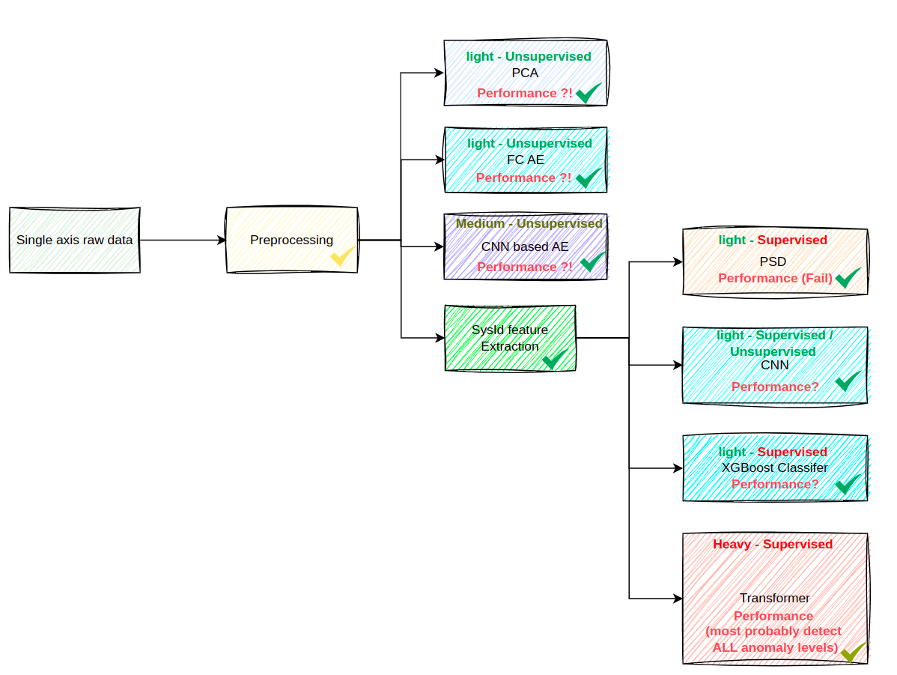
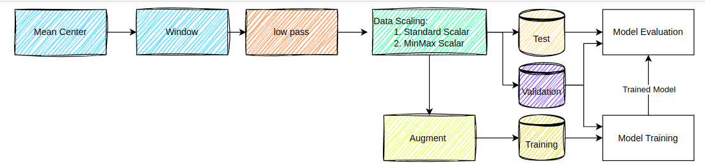

# un-sand-on-edge
This repository contains different applications of UN-Supervised ANomaly Detection for AI-driven methods deployed ON resource-constrained devices at EDGE for the SHM application. 

The current vision of the project is shown below:



# Data 

The dataset of this work consists of normal case and 9 levels of anomalies, configured by adding masses over the structure. 
The following table shows how these anomalies are applied to the top floor of the structure where sensors are installed: 

| Anomaly Level | Mass (kg) |
|---------------|-----------|
| Level 1       | 1.5        |
| Level 2       | 2.8        |
| Level 3       | 3.6        |
| Level 4       | 4.6        |
| Level 5       | 5.6        |
| Level 6       | 6.6        |
| Level 7       | 7.6        |
| Level 8       | 8.6        |
| Level 9       | 9.6        |

The data is accessible at [TBD]. 

The data folder MUST be kept locally on your machine; the person pushing a folder titled "data" would be responsible for the mess with the repository. 
We will hunt you for this push. 

We highly recommend saving the data somewhere in your local machine and creating a symlink to the top directory of this repository. 
This is usually done with the following command:  

``` bash
ln -s /path/to/the/dataset data
```

# Python Virtual Environment

## Python Requirement 
In order to run all the scripts, you should have downloaded and installed python 3.11 on your machine. You can do it by following the following tutorial: 

**Ubuntu**: 
[Python 3.11 Installation](https://www.linuxcapable.com/how-to-install-python-3-11-on-ubuntu-linux/)

**Windows**: 
[Python 3.11 Installation](https://www.python.org/downloads/release/python-3110/)

## Installation 
To set up the Python virtual environment, use the following commands in the folder of this repository:
```bash 
sudo python3.11 -m venv myenv 
cd myenv/bin/
source activate
``` 

*Note:* You can chnge ```myenv``` with your desired environment name. 


# Getting Started with PySHM
This repository contains the front applications to achieve the results of the [TBD] paper. This application inherits features and built-in classes and methods from the two Python packages, i.e., numpy and PyTorch. Thus, a customized Python package for TimeSeries data is developed for the backend classes and methods. 

The package is titled "PySHM" and is accessible [here](https://github.com/MiirHo3eIN/pyshm).
The former package must be installed to run applications and scripts for this repository.    

## Installation
After cloning the PySHM repository, you can run the following command from the top directory to install it in your Python environment. 

``` python -m pip install -e .```

*Note:* A more detailed installation guide is presented in the [pyshm repository](https://github.com/MiirHo3eIN/pyshm)  


# Offline mode Pipeline.
In the offline phase of our application, we explore the different model-based and data-driven approaches to find the optimal solution for the anomaly detection tasks. This part of the analysis explores different hyperparameters and filtering data for a generic dataset. The whole process in divided into three main sections which are: 
1. Pre-processing (numpy based)
2. Training (PyTorch based)
3. Test and Validation (Pytorch based). 
The following figure shows our study's offline pipeline:  



# Online mode Pipeline.

TODO
